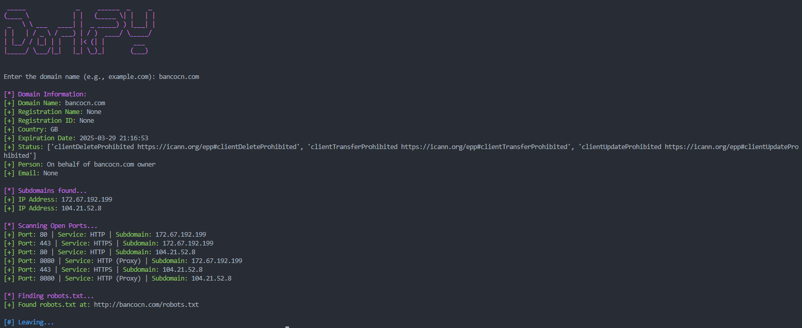

# DorkPY

DorkPY é uma ferramenta de pentest desenvolvida em Python para coletar informações sobre um determinado domínio, incluindo:

- Informações de domínio
- Subdomínios encontrados
- Portas abertas
- Arquivo robots.txt encontrado

## Instalação

### Clonar o repositório

```bash
git clone https://github.com/solvezera/DorkPY.git
cd DorkPY
```

### Configuração do ambiente virtual (opcional, mas recomendado)

```bash
python -m venv venv
```

### Ativar o ambiente virtual

- No Windows:
  ```bash
  venv\Scripts\activate
  ```
- No macOS e Linux:
  ```bash
  source venv/bin/activate
  ```

### Instalar dependências

```bash
pip install -r requirements.txt
```

## Uso

```bash
python dorkpy.py
```

## Saída


**_Foi utilizado o domínio http://www.bancocn.com/ , esse site é ficcional e foi criado para fins didáticos pela [Solyd Tecnologia](https://solyd.com.br/)_**

## Contribuição

Contribuições são bem-vindas! Se você encontrar algum problema ou tiver sugestões de melhorias, sinta-se à vontade para abrir uma [issue](https://github.com/Solvezera/DorkPY/issues) ou enviar um [pull request](https://github.com/Solvezera/DorkPY/pulls).

## Licença

Este projeto é licenciado sob a [MIT License](https://opensource.org/licenses/MIT).
